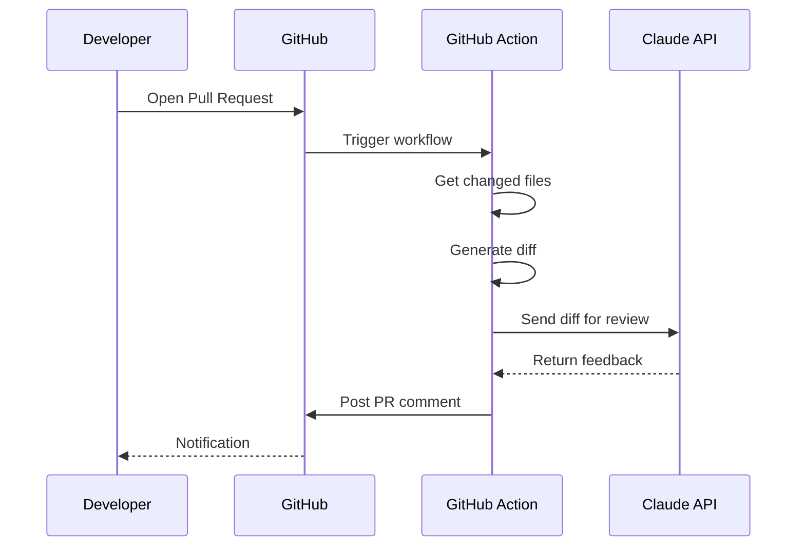

<p align="center">
  <a href="https://www.bemind.tech/">
    
  </a>
</p>

<p align="center">
  <h1 align="center">Monorepo Template</h1>
  <p align="center">
    A production-ready TypeScript monorepo template with Turborepo
    <br />
    <a href="#get-started"><strong>Get Started</strong></a>
    ·
    <a href="#documentation"><strong>Docs</strong></a>
    ·
    <a href="https://github.com/your-org/monorepo-template/issues"><strong>Report Bug</strong></a>
    ·
    <a href="https://github.com/your-org/monorepo-template/issues"><strong>Request Feature</strong></a>
  </p>
</p>

<p align="center">
  <a href="LICENSE"></a>
  <a href="#"></a>
  <a href="#"></a>
  <a href="#"></a>
  <a href="#"></a>
</p>

---

## Overview

A modern TypeScript monorepo template featuring Turborepo for high-performance builds, pnpm workspaces for efficient dependency management, and comprehensive tooling for professional development workflows.

### Why This Template?

- **Fast Builds** - Turborepo caching for incremental builds
- **Type Safety** - TypeScript strict mode across all packages
- **Modern Tooling** - ESLint 9, Prettier, Vitest, Husky, Commitlint
- **Workspace Ready** - Shared packages with proper exports
- **CI/CD Ready** - GitHub Actions workflows included

## Features

| Feature                    | Description                                       |
| -------------------------- | ------------------------------------------------- |
| **Monorepo Architecture**  | Turborepo for fast, efficient builds with caching |
| **TypeScript Strict Mode** | Full type safety across all packages              |
| **pnpm Workspaces**        | Efficient dependency management                   |
| **Modern Tooling**         | ESLint 9, Prettier, Vitest, Husky, Commitlint     |
| **CI/CD Ready**            | GitHub Actions workflows included                 |
| **Dual Exports**           | ESM and CommonJS support via tsup                 |
| **Example Web App**        | Vite + React 19 starter included                  |
| **Infrastructure Ready**   | Docker, Kubernetes (Minikube), Firebase configs   |
| **Port Management**        | Reserved port ranges (3000-3099) for services     |
| **Conventional Commits**   | Enforced commit messages with Commitlint          |
| **Pre-commit Hooks**       | Automated linting and formatting on commit        |
| **Comprehensive Docs**     | Architecture diagrams, guides, and wiki           |

## Tech Stack

### Core

| Technology                                    | Version | Purpose                                |
| --------------------------------------------- | ------- | -------------------------------------- |
| [TypeScript](https://www.typescriptlang.org/) | 5.9+    | Type-safe JavaScript                   |
| [Node.js](https://nodejs.org/)                | 22+     | JavaScript runtime                     |
| [pnpm](https://pnpm.io/)                      | 9+      | Fast, disk-efficient package manager   |
| [Turborepo](https://turbo.build/)             | 2+      | High-performance monorepo build system |

### Frontend

| Technology                       | Version | Purpose                          |
| -------------------------------- | ------- | -------------------------------- |
| [React](https://react.dev/)      | 19      | UI component library             |
| [Vite](https://vite.dev/)        | 6+      | Next-generation frontend tooling |
| [tsup](https://tsup.egoist.dev/) | 8+      | TypeScript bundler (ESM + CJS)   |

### Code Quality

| Technology                                                | Version | Purpose                 |
| --------------------------------------------------------- | ------- | ----------------------- |
| [ESLint](https://eslint.org/)                             | 9+      | Code linting            |
| [Prettier](https://prettier.io/)                          | 3+      | Code formatting         |
| [Husky](https://typicode.github.io/husky/)                | 9+      | Git hooks               |
| [Commitlint](https://commitlint.js.org/)                  | 19+     | Commit message linting  |
| [lint-staged](https://github.com/lint-staged/lint-staged) | 15+     | Pre-commit file linting |

### Testing

| Technology                                               | Version | Purpose                    |
| -------------------------------------------------------- | ------- | -------------------------- |
| [Vitest](https://vitest.dev/)                            | 3+      | Unit & integration testing |
| [@vitest/coverage-v8](https://vitest.dev/guide/coverage) | 3+      | Code coverage              |

### Infrastructure

| Technology                                         | Purpose                             |
| -------------------------------------------------- | ----------------------------------- |
| [Docker](https://www.docker.com/)                  | Containerization                    |
| [Docker Compose](https://docs.docker.com/compose/) | Multi-container orchestration       |
| [Kubernetes](https://kubernetes.io/)               | Container orchestration             |
| [Minikube](https://minikube.sigs.k8s.io/)          | Local Kubernetes cluster            |
| [Kustomize](https://kustomize.io/)                 | Kubernetes configuration management |
| [Firebase](https://firebase.google.com/)           | Hosting, Firestore, Authentication  |

### CI/CD

| Technology                                             | Purpose                             |
| ------------------------------------------------------ | ----------------------------------- |
| [GitHub Actions](https://github.com/features/actions)  | Continuous integration & deployment |
| [Changesets](https://github.com/changesets/changesets) | Version management & changelogs     |

### Configuration

| Technology                                   | Purpose                         |
| -------------------------------------------- | ------------------------------- |
| [Zod](https://zod.dev/)                      | Runtime type validation         |
| [dotenv](https://github.com/motdotla/dotenv) | Environment variable management |

## Table of Contents

- [Tech Stack](#tech-stack)
- [Get Started](#get-started)
- [Project Structure](#project-structure)
- [Applications](#applications)
- [Packages](#packages)
- [Infrastructure](#infrastructure)
- [Port Assignments](#port-assignments)
- [Creating Packages](#creating-a-new-package)
- [Creating Apps](#creating-a-new-app)
- [Scripts](#available-scripts)
- [AI Code Review](#ai-code-review)
- [Agentic Workflows](#agentic-workflows)
- [Roadmap](#roadmap)
- [AI Cost Estimation](#ai-cost-estimation)
- [Documentation](#documentation)
- [Contributing](#contributing)
- [License](#license)

## Get Started

### Prerequisites

Before you begin, ensure you have the following installed:

| Tool    | Version   | Installation                        |
| ------- | --------- | ----------------------------------- |
| Node.js | >= 22.0.0 | [nodejs.org](https://nodejs.org/)   |
| pnpm    | >= 9.0.0  | `npm install -g pnpm`               |
| Git     | Latest    | [git-scm.com](https://git-scm.com/) |

Verify your installation:

```bash
node --version   # Should output v22.x.x or higher
pnpm --version   # Should output 9.x.x or higher
git --version    # Any recent version
```

### Step 1: Clone the Repository

```bash
# Clone the repository
git clone https://github.com/your-org/monorepo-template.git

# Navigate to the project
cd monorepo-template
```

### Step 2: Install Dependencies

```bash
# Install all dependencies
pnpm install
```

This will:

- Install dependencies for all packages and apps
- Set up git hooks via Husky
- Link workspace packages together

### Step 3: Build Shared Packages

```bash
# Build the shared packages first
pnpm build:packages
```

This builds packages in dependency order:

1. `@monorepo/shared` - Types and utilities
2. `@monorepo/config` - Configuration
3. `@monorepo/core` - Core framework

### Step 4: Start Development

```bash
# Start all packages in development mode
pnpm dev
```

Or start a specific package:

```bash
# Start only the core package
pnpm dev --filter=@monorepo/core
```

### Step 5: Verify Setup

Run the test suite to verify everything is working:

```bash
# Run all tests
pnpm test

# Type check all packages
pnpm type-check

# Lint all packages
pnpm lint
```

### Quick Command Reference

| Command        | Description            |
| -------------- | ---------------------- |
| `pnpm install` | Install dependencies   |
| `pnpm dev`     | Start development mode |
| `pnpm build`   | Build all packages     |
| `pnpm test`    | Run tests              |
| `pnpm lint`    | Check code quality     |

## Project Structure

```
monorepo-template/
├── apps/                    # Applications
│   └── web/                 # Vite + React web application
├── packages/                # Shared packages
│   ├── core/                # Core framework utilities
│   ├── shared/              # Shared types and utilities
│   └── config/              # Configuration utilities
├── infra/                   # Infrastructure configs
│   ├── docker/              # Docker & docker-compose
│   ├── k8s/                 # Kubernetes with Kustomize
│   └── firebase/            # Firebase Hosting & Firestore
├── docs/                    # Documentation
│   ├── architecture/        # Architecture diagrams
│   ├── design/              # UI/UX design system
│   ├── git/                 # Git workflow guides
│   ├── qa/                  # Testing guides
│   └── deploy/              # Deployment guides
├── tools/                   # CLI tools
├── scripts/                 # Setup and utility scripts
├── tests/                   # Test suites
│   ├── unit/                # Unit tests
│   ├── integration/         # Integration tests
│   └── e2e/                 # End-to-end tests
├── wiki/                    # GitHub wiki pages
├── .github/                 # GitHub Actions workflows
└── .agent/                  # Agentic workflow configs
    ├── workflows/           # Workflow definitions
    └── prompts/             # Reusable prompts
```

## Applications

### @monorepo/web

A Vite + React 19 web application with TypeScript.

```bash
# Start development server
pnpm dev --filter=@monorepo/web

# Build for production
pnpm build --filter=@monorepo/web

# Preview production build
pnpm --filter=@monorepo/web preview
```

**Features:**

- Vite 6 with React 19
- TypeScript strict mode
- Hot Module Replacement (HMR)
- Path aliases (`@/` → `src/`)
- Production-optimized builds

**Access:** http://localhost:5173 (dev) or http://localhost:3000 (preview)

## Agents

AI agent implementations for various use cases.

### Creating an Agent

```bash
# Create agent directory
mkdir -p agents/my-agent/src

# Create package.json
cat > agents/my-agent/package.json << 'EOF'
{
  "name": "@monorepo/my-agent",
  "version": "0.1.0",
  "private": true,
  "type": "module",
  "main": "./dist/index.js",
  "types": "./dist/index.d.ts",
  "scripts": {
    "build": "tsup",
    "dev": "tsx watch src/index.ts",
    "start": "node dist/index.js"
  },
  "dependencies": {
    "@monorepo/core": "workspace:*",
    "@anthropic-ai/sdk": "^0.30.0"
  }
}
EOF
```

### Agent Architecture

```
agents/
├── my-agent/
│   ├── src/
│   │   ├── index.ts        # Entry point
│   │   ├── agent.ts        # Agent implementation
│   │   ├── tools/          # Agent tools
│   │   └── prompts/        # System prompts
│   ├── package.json
│   └── tsconfig.json
```

### Example Agent

```typescript
import Anthropic from '@anthropic-ai/sdk';

const client = new Anthropic();

async function runAgent(input: string) {
  const response = await client.messages.create({
    model: 'claude-sonnet-4-20250514',
    max_tokens: 1024,
    messages: [{ role: 'user', content: input }],
  });
  return response.content[0].text;
}
```

See [Agent Architecture](docs/architecture/agent-architecture.md) for detailed patterns.

## Packages

### @monorepo/shared

Shared types and utilities across all packages:

```typescript
import { SomeType, someConstant } from '@monorepo/shared';
```

- Common type definitions
- Error classes
- Utility functions
- Constants

### @monorepo/config

Environment and configuration utilities:

```typescript
import { loadEnv, isDev, isProd } from '@monorepo/config';

const config = loadEnv();
if (isDev()) {
  console.log('Development mode');
}
```

- Environment variable validation with Zod
- dotenv integration
- Helper functions (`isDev()`, `isProd()`, `isTest()`)

### @monorepo/core

Core framework providing base utilities and helpers:

```typescript
import { someUtility } from '@monorepo/core';
```

## Infrastructure

Ready-to-use infrastructure configurations for deployment.

### Docker

Local development with Docker Compose:

```bash
# Start development stack (web + redis + postgres)
docker-compose -f infra/docker/docker-compose.yml up

# Build production image
docker build -f infra/docker/Dockerfile -t monorepo/web:latest .
```

**Services included:**

- Web application (port 3000/5173)
- Redis cache (port 6379)
- PostgreSQL database (port 5432)

### Kubernetes (Minikube)

Local Kubernetes development:

```bash
# Start minikube
minikube start --driver=docker
minikube addons enable ingress

# Deploy to development environment
kubectl apply -k infra/k8s/overlays/development

# Access the application
minikube service web-dev-nodeport -n monorepo-dev --url
```

**Environments:**
| Environment | Namespace | Replicas |
|-------------|-----------|----------|
| Development | monorepo-dev | 1 |
| Staging | monorepo-staging | 2 |
| Production | monorepo-prod | 3 |

### Firebase

Firebase Hosting and Firestore:

```bash
# Install Firebase CLI
npm install -g firebase-tools

# Start local emulators
cd infra/firebase && firebase emulators:start

# Deploy to Firebase
firebase deploy
```

**Emulator URLs:**

- Hosting: http://localhost:5000
- Firestore: http://localhost:8080
- Emulator UI: http://localhost:4000

See [infra/README.md](infra/README.md) for detailed deployment guides.

## Port Assignments

Reserved port ranges for consistent service allocation across the monorepo.

### Application Ports (3000-3099)

| Port Range | Service              | Description             |
| ---------- | -------------------- | ----------------------- |
| 3000       | Web App (Production) | Main web server         |
| 3001       | Web App (Preview)    | Vite preview mode       |
| 3002-3009  | Additional Web Apps  | Reserved for apps       |
| 3010-3019  | API Services         | REST/GraphQL APIs       |
| 3020-3029  | WebSocket Services   | Real-time communication |
| 3030-3039  | Background Workers   | Queue processors        |
| 3040-3049  | Documentation        | Storybook, API docs     |
| 3050-3059  | Testing              | Test servers            |
| 3060-3069  | Monitoring           | Metrics, health checks  |
| 3070-3079  | Admin Tools          | Internal tools          |
| 3080-3089  | Development Tools    | Dev utilities           |
| 3090-3099  | Reserved             | Future use              |

### Vite Development Ports

| Port  | Service                  |
| ----- | ------------------------ |
| 5173  | @monorepo/web (Vite dev) |
| 5174+ | Additional Vite apps     |

### Infrastructure Ports

| Port  | Service              |
| ----- | -------------------- |
| 4000  | Firebase Emulator UI |
| 5000  | Firebase Hosting     |
| 5432  | PostgreSQL           |
| 6379  | Redis                |
| 8080  | Firestore Emulator   |
| 9199  | Storage Emulator     |
| 30080 | Kubernetes NodePort  |

## Creating a New Package

### 1. Create directory structure

```bash
mkdir -p packages/my-package/src
```

### 2. Create package.json

```bash
cat > packages/my-package/package.json << 'EOF'
{
  "name": "@monorepo/my-package",
  "version": "0.1.0",
  "private": true,
  "type": "module",
  "main": "./dist/index.js",
  "module": "./dist/index.mjs",
  "types": "./dist/index.d.ts",
  "exports": {
    ".": {
      "types": "./dist/index.d.ts",
      "import": "./dist/index.mjs",
      "require": "./dist/index.js"
    }
  },
  "scripts": {
    "build": "tsup",
    "dev": "tsup --watch",
    "lint": "eslint src/",
    "type-check": "tsc --noEmit",
    "test": "vitest run",
    "clean": "rimraf dist"
  },
  "dependencies": {
    "@monorepo/shared": "workspace:*"
  },
  "devDependencies": {
    "tsup": "^8.3.5",
    "vitest": "^2.1.8"
  }
}
EOF
```

### 3. Create tsconfig.json

```bash
cat > packages/my-package/tsconfig.json << 'EOF'
{
  "extends": "../../tsconfig.base.json",
  "compilerOptions": {
    "outDir": "./dist",
    "rootDir": "./src"
  },
  "include": ["src/**/*"]
}
EOF
```

### 4. Create source file

```bash
cat > packages/my-package/src/index.ts << 'EOF'
export function hello(name: string): string {
  return `Hello, ${name}!`;
}
EOF
```

### 5. Install and build

```bash
pnpm install
pnpm build --filter=@monorepo/my-package
```

## Creating a New App

### 1. Create directory structure

```bash
mkdir -p apps/my-app/src
```

### 2. Create package.json

```bash
cat > apps/my-app/package.json << 'EOF'
{
  "name": "@monorepo/my-app",
  "version": "0.1.0",
  "private": true,
  "type": "module",
  "scripts": {
    "dev": "tsx watch src/index.ts",
    "build": "tsup",
    "start": "node dist/index.js",
    "lint": "eslint src/",
    "type-check": "tsc --noEmit"
  },
  "dependencies": {
    "@monorepo/core": "workspace:*",
    "@monorepo/config": "workspace:*"
  },
  "devDependencies": {
    "tsup": "^8.3.5",
    "tsx": "^4.19.0"
  }
}
EOF
```

### 3. Create source file

```bash
cat > apps/my-app/src/index.ts << 'EOF'
import { isDev } from '@monorepo/config';

function main() {
  console.log('App started');
  console.log('Development mode:', isDev());
}

main();
EOF
```

### 4. Run the app

```bash
pnpm install
pnpm dev --filter=@monorepo/my-app
```

## Available Scripts

### Development

| Script                | Description                             |
| --------------------- | --------------------------------------- |
| `pnpm dev`            | Start development mode for all packages |
| `pnpm build`          | Build all packages                      |
| `pnpm build:packages` | Build only shared packages              |
| `pnpm clean`          | Clean all build artifacts               |

### Code Quality

| Script              | Description                  |
| ------------------- | ---------------------------- |
| `pnpm lint`         | Run ESLint on all packages   |
| `pnpm lint:fix`     | Fix ESLint issues            |
| `pnpm format`       | Format code with Prettier    |
| `pnpm format:check` | Check code formatting        |
| `pnpm type-check`   | Run TypeScript type checking |

### Testing

| Script                  | Description             |
| ----------------------- | ----------------------- |
| `pnpm test`             | Run all tests           |
| `pnpm test:watch`       | Run tests in watch mode |
| `pnpm test:coverage`    | Run tests with coverage |
| `pnpm test:unit`        | Run unit tests only     |
| `pnpm test:integration` | Run integration tests   |
| `pnpm test:e2e`         | Run end-to-end tests    |

### Docker

| Script             | Description                |
| ------------------ | -------------------------- |
| `pnpm docker:up`   | Start Docker Compose stack |
| `pnpm docker:down` | Stop Docker Compose stack  |

### Filtering Commands

Run commands for specific packages:

```bash
# Build specific package
pnpm build --filter=@monorepo/core

# Run tests for packages matching pattern
pnpm test --filter="@monorepo/*"

# Run dev for apps only
pnpm dev --filter="./apps/*"
```

## AI Code Review

Set up an AI agent to automatically review pull requests on GitHub.

### Prerequisites

1. GitHub repository with Actions enabled
2. API key from an AI provider (Claude, OpenAI, etc.)

### Step 1: Add Secrets

Add your API key to GitHub repository secrets:

```
Settings → Secrets and variables → Actions → New repository secret
```

| Secret Name         | Description                  |
| ------------------- | ---------------------------- |
| `ANTHROPIC_API_KEY` | Claude API key               |
| `OPENAI_API_KEY`    | OpenAI API key (alternative) |

### Step 2: Create Workflow

Create `.github/workflows/ai-code-review.yml`:

```yaml
name: AI Code Review

on:
  pull_request:
    types: [opened, synchronize, reopened]

permissions:
  contents: read
  pull-requests: write

jobs:
  review:
    runs-on: ubuntu-latest
    steps:
      - name: Checkout
        uses: actions/checkout@v4
        with:
          fetch-depth: 0

      - name: Get changed files
        id: changed
        run: |
          echo "files=$(git diff --name-only origin/${{ github.base_ref }}...HEAD | tr '\n' ' ')" >> $GITHUB_OUTPUT

      - name: Setup Node.js
        uses: actions/setup-node@v4
        with:
          node-version: '22'

      - name: Install dependencies
        run: npm install @anthropic-ai/sdk

      - name: AI Review
        env:
          ANTHROPIC_API_KEY: ${{ secrets.ANTHROPIC_API_KEY }}
          GITHUB_TOKEN: ${{ secrets.GITHUB_TOKEN }}
          PR_NUMBER: ${{ github.event.pull_request.number }}
          CHANGED_FILES: ${{ steps.changed.outputs.files }}
        run: |
          node << 'EOF'
          const Anthropic = require('@anthropic-ai/sdk');
          const fs = require('fs');
          const { execSync } = require('child_process');

          async function review() {
            const client = new Anthropic();
            const files = process.env.CHANGED_FILES.trim().split(' ').filter(Boolean);

            if (files.length === 0) {
              console.log('No files to review');
              return;
            }

            // Get diff for changed files
            const diff = execSync(`git diff origin/${process.env.GITHUB_BASE_REF}...HEAD -- ${files.join(' ')}`).toString();

            const response = await client.messages.create({
              model: 'claude-sonnet-4-20250514',
              max_tokens: 4096,
              messages: [{
                role: 'user',
                content: `Review this code diff and provide constructive feedback. Focus on:
                - Code quality and best practices
                - Potential bugs or issues
                - Performance considerations
                - Security concerns

                Be concise and actionable. Format as markdown.

                \`\`\`diff
                ${diff.slice(0, 50000)}
                \`\`
                `
              }]
            });

            const review = response.content[0].text;

            // Post comment to PR
            execSync(`gh pr comment ${process.env.PR_NUMBER} --body "${review.replace(/"/g, '\"')}"`, {
              env: { ...process.env, GH_TOKEN: process.env.GITHUB_TOKEN }
            });
          }

          review().catch(console.error);
          EOF
```

### Step 3: Configure Review Scope

Optionally, create `.github/ai-review-config.json`:

```json
{
  "include": ["src/**/*.ts", "src/**/*.tsx"],
  "exclude": ["**/*.test.ts", "**/*.spec.ts"],
  "maxFilesPerReview": 10,
  "focusAreas": ["security", "performance", "best-practices", "type-safety"]
}
```

### How It Works



### Example Output

The AI reviewer will post comments like:

> **AI Code Review** 🤖
>
> **Summary:** This PR adds user authentication middleware.
>
> **Suggestions:**
>
> - ⚠️ Line 45: Consider using `bcrypt.compare()` with constant-time comparison
> - 💡 Line 72: Add rate limiting to prevent brute force attacks
> - ✅ Good use of TypeScript strict mode
>
> **Security:** No critical issues found.

### Alternative: Use Existing Actions

You can also use pre-built actions:

```yaml
- name: AI Code Review
  uses: coderabbitai/ai-pr-reviewer@latest
  with:
    GITHUB_TOKEN: ${{ secrets.GITHUB_TOKEN }}
    OPENAI_API_KEY: ${{ secrets.OPENAI_API_KEY }}
```

### Best Practices

1. **Limit scope** - Review only relevant file types
2. **Set token limits** - Avoid excessive API costs
3. **Human oversight** - AI suggestions need human approval
4. **Secure secrets** - Never expose API keys in logs
5. **Rate limiting** - Add delays between API calls

## Codex Workflow Support

Codex CLI users can rely on the `.codex/` folder for repository-aware automation and guardrails.

### Configuration Files

- `.codex/settings/config.json` & `.codex/settings/mcp.json` capture project metadata, default commands, and MCP server definitions (filesystem + git). Codex loads these automatically, so keep runtime versions and workspace paths current when the monorepo evolves.
- `.codex/rules.md` mirrors our contributor expectations—pnpm-only, strict TypeScript, ≥80% coverage on touched code, docs synced with structural changes. Update it alongside process changes to keep Codex guidance accurate.

### Built-in Codex Workflows

| Workflow        | Purpose                                                                                                                      | Command                            |
| --------------- | ---------------------------------------------------------------------------------------------------------------------------- | ---------------------------------- |
| `bootstrap`     | Clone, install pnpm deps, copy `.env.example`, build shared packages, and start Turborepo watch tasks.                       | `codex workflow run bootstrap`     |
| `quality-check` | Run Prettier checks, ESLint, `pnpm type-check`, Vitest suites, targeted builds, and Docker smoke tests before any commit/PR. | `codex workflow run quality-check` |
| `release`       | Execute the Changesets flow (`pnpm changeset`, `version-packages`, `release`) with final lint/type/test/build verification.  | `codex workflow run release`       |

Codex automatically surfaces these playbooks via `codex workflow list`. When you add new workflows, drop Markdown guides into `.codex/workflows/` and reference them here. This keeps AI assistants aligned with the same pipelines humans follow.

## Roadmap

Future plans and upcoming features for the monorepo template.

### AI Provider Integrations

| Provider                                                                        | Status       | Description                     |
| ------------------------------------------------------------------------------- | ------------ | ------------------------------- |
| [Claude (Anthropic)](https://anthropic.com)                                     | ✅ Supported | Claude 3.5 Sonnet, Opus, Haiku  |
| [OpenAI](https://openai.com)                                                    | ✅ Supported | GPT-4o, GPT-4 Turbo             |
| [Google Gemini](https://ai.google.dev)                                          | ✅ Supported | Gemini Pro, Gemini Ultra        |
| [Ollama](https://ollama.ai)                                                     | ✅ Supported | Local LLMs (Llama, Mistral)     |
| [ChatGLM (Zhipu AI)](https://open.bigmodel.cn)                                  | 🔜 Planned   | GLM-4, Chinese language support |
| [Mistral AI](https://mistral.ai)                                                | 🔜 Planned   | Mistral Large, Mixtral          |
| [Cohere](https://cohere.com)                                                    | 🔜 Planned   | Command, Embed models           |
| [AWS Bedrock](https://aws.amazon.com/bedrock)                                   | 🔜 Planned   | Multi-provider via AWS          |
| [Azure OpenAI](https://azure.microsoft.com/products/ai-services/openai-service) | 🔜 Planned   | Enterprise OpenAI               |
| [DeepSeek](https://deepseek.com)                                                | 🔜 Planned   | DeepSeek Coder, Chat            |
| [Qwen (Alibaba)](https://qwenlm.github.io)                                      | 🔜 Planned   | Qwen-72B, multilingual          |

### Agent Framework

| Feature                   | Status         | Description                     |
| ------------------------- | -------------- | ------------------------------- |
| Simple Agent              | ✅ Done        | Single-turn completion          |
| Tool Agent                | ✅ Done        | Function calling support        |
| Stateful Agent            | 🚧 In Progress | Conversation memory             |
| Multi-Agent Orchestration | 🔜 Planned     | Coordinate multiple agents      |
| Agent Memory              | 🔜 Planned     | Long-term memory with vector DB |
| Streaming Responses       | 🔜 Planned     | Real-time token streaming       |
| Agent Metrics             | 🔜 Planned     | Token usage, latency tracking   |
| Agent Playground          | 🔜 Planned     | Web UI for testing agents       |

### Infrastructure

| Feature              | Status     | Description            |
| -------------------- | ---------- | ---------------------- |
| Docker Compose       | ✅ Done    | Local development      |
| Kubernetes/Kustomize | ✅ Done    | K8s deployments        |
| Firebase Hosting     | ✅ Done    | Static hosting         |
| GitHub Actions CI/CD | ✅ Done    | Automated pipelines    |
| Terraform            | 🔜 Planned | Infrastructure as Code |
| Pulumi               | 🔜 Planned | IaC alternative        |
| AWS CDK              | 🔜 Planned | AWS deployment         |
| Helm Charts          | 🔜 Planned | K8s package manager    |
| ArgoCD               | 🔜 Planned | GitOps deployment      |

### Observability

| Feature            | Status         | Description            |
| ------------------ | -------------- | ---------------------- |
| Structured Logging | 🚧 In Progress | JSON logs with context |
| Prometheus Metrics | 🔜 Planned     | Application metrics    |
| Grafana Dashboards | 🔜 Planned     | Visualization          |
| OpenTelemetry      | 🔜 Planned     | Distributed tracing    |
| Sentry             | 🔜 Planned     | Error tracking         |
| ELK Stack          | 🔜 Planned     | Log aggregation        |

### Developer Experience

| Feature              | Status     | Description               |
| -------------------- | ---------- | ------------------------- |
| TypeScript 5.9+      | ✅ Done    | Strict type checking      |
| ESLint 9 Flat Config | ✅ Done    | Modern linting            |
| Vitest               | ✅ Done    | Fast unit testing         |
| Husky + Commitlint   | ✅ Done    | Git hooks                 |
| CLI Scaffolding Tool | 🔜 Planned | `npx create-monorepo-app` |
| VS Code Extension    | 🔜 Planned | IDE integration           |
| Storybook            | 🔜 Planned | Component documentation   |
| Nx Cloud             | 🔜 Planned | Remote caching            |

### Security

| Feature            | Status     | Description          |
| ------------------ | ---------- | -------------------- |
| Non-root Docker    | ✅ Done    | Secure containers    |
| Firestore Rules    | ✅ Done    | Database security    |
| OAuth 2.0 / OIDC   | 🔜 Planned | Authentication       |
| API Rate Limiting  | 🔜 Planned | DDoS protection      |
| Secrets Management | 🔜 Planned | Vault integration    |
| SAST/DAST          | 🔜 Planned | Security scanning    |
| Dependency Audit   | 🔜 Planned | Automated CVE checks |

### Testing

| Feature             | Status     | Description          |
| ------------------- | ---------- | -------------------- |
| Unit Tests (Vitest) | ✅ Done    | Component testing    |
| Playwright E2E      | 🔜 Planned | Browser testing      |
| k6 Load Testing     | 🔜 Planned | Performance testing  |
| Contract Testing    | 🔜 Planned | API contracts (Pact) |
| Visual Regression   | 🔜 Planned | Screenshot testing   |
| Mutation Testing    | 🔜 Planned | Test quality         |

### Database & Storage

| Feature         | Status     | Description               |
| --------------- | ---------- | ------------------------- |
| Firestore       | ✅ Done    | NoSQL database            |
| PostgreSQL      | 🔜 Planned | Relational database       |
| Redis           | 🔜 Planned | Caching layer             |
| Prisma ORM      | 🔜 Planned | Type-safe database        |
| Vector Database | 🔜 Planned | Pinecone/Weaviate for RAG |
| S3/GCS Storage  | 🔜 Planned | File storage              |

### API & Communication

| Feature   | Status     | Description             |
| --------- | ---------- | ----------------------- |
| REST API  | 🔜 Planned | Express/Fastify         |
| GraphQL   | 🔜 Planned | Apollo Server           |
| tRPC      | 🔜 Planned | End-to-end type safety  |
| WebSocket | 🔜 Planned | Real-time communication |
| gRPC      | 🔜 Planned | High-performance RPC    |

### Legend

| Symbol | Meaning          |
| ------ | ---------------- |
| ✅     | Done / Supported |
| 🚧     | In Progress      |
| 🔜     | Planned          |

## AI Cost Estimation

Estimated costs for AI provider usage in agent development.

### Token Pricing (as of 2024)

#### Claude (Anthropic)

| Model             | Input (per 1M tokens) | Output (per 1M tokens) | Context |
| ----------------- | --------------------- | ---------------------- | ------- |
| Claude 3.5 Sonnet | $3.00                 | $15.00                 | 200K    |
| Claude 3.5 Haiku  | $0.25                 | $1.25                  | 200K    |
| Claude 3 Opus     | $15.00                | $75.00                 | 200K    |
| Claude 3 Sonnet   | $3.00                 | $15.00                 | 200K    |
| Claude 3 Haiku    | $0.25                 | $1.25                  | 200K    |

#### OpenAI

| Model         | Input (per 1M tokens) | Output (per 1M tokens) | Context |
| ------------- | --------------------- | ---------------------- | ------- |
| GPT-4o        | $2.50                 | $10.00                 | 128K    |
| GPT-4o mini   | $0.15                 | $0.60                  | 128K    |
| GPT-4 Turbo   | $10.00                | $30.00                 | 128K    |
| GPT-3.5 Turbo | $0.50                 | $1.50                  | 16K     |
| o1-preview    | $15.00                | $60.00                 | 128K    |
| o1-mini       | $3.00                 | $12.00                 | 128K    |

#### Google Gemini

| Model            | Input (per 1M tokens) | Output (per 1M tokens) | Context |
| ---------------- | --------------------- | ---------------------- | ------- |
| Gemini 1.5 Pro   | $1.25                 | $5.00                  | 2M      |
| Gemini 1.5 Flash | $0.075                | $0.30                  | 1M      |
| Gemini 1.0 Pro   | $0.50                 | $1.50                  | 32K     |

#### Mistral AI

| Model          | Input (per 1M tokens) | Output (per 1M tokens) | Context |
| -------------- | --------------------- | ---------------------- | ------- |
| Mistral Large  | $2.00                 | $6.00                  | 128K    |
| Mistral Medium | $2.70                 | $8.10                  | 32K     |
| Mistral Small  | $0.20                 | $0.60                  | 32K     |
| Mixtral 8x7B   | $0.70                 | $0.70                  | 32K     |

#### ChatGLM (Zhipu AI)

| Model       | Input (per 1M tokens) | Output (per 1M tokens) | Context |
| ----------- | --------------------- | ---------------------- | ------- |
| GLM-4       | ¥100 (~$14)           | ¥100 (~$14)            | 128K    |
| GLM-4-Flash | ¥1 (~$0.14)           | ¥1 (~$0.14)            | 128K    |
| GLM-3-Turbo | ¥5 (~$0.70)           | ¥5 (~$0.70)            | 128K    |

#### DeepSeek

| Model          | Input (per 1M tokens) | Output (per 1M tokens) | Context |
| -------------- | --------------------- | ---------------------- | ------- |
| DeepSeek-V3    | $0.27                 | $1.10                  | 64K     |
| DeepSeek-Coder | $0.14                 | $0.28                  | 64K     |

#### Qwen (Alibaba)

| Model      | Input (per 1M tokens) | Output (per 1M tokens) | Context |
| ---------- | --------------------- | ---------------------- | ------- |
| Qwen-Max   | ¥120 (~$17)           | ¥120 (~$17)            | 32K     |
| Qwen-Plus  | ¥4 (~$0.56)           | ¥4 (~$0.56)            | 128K    |
| Qwen-Turbo | ¥2 (~$0.28)           | ¥2 (~$0.28)            | 128K    |

#### Local (Ollama) - Free

| Model         | Cost | Hardware Required |
| ------------- | ---- | ----------------- |
| Llama 3.1 8B  | Free | 8GB RAM           |
| Llama 3.1 70B | Free | 48GB RAM          |
| Mistral 7B    | Free | 8GB RAM           |
| CodeLlama 34B | Free | 24GB RAM          |
| Qwen2 7B      | Free | 8GB RAM           |

### Cost Estimation by Use Case

#### Code Review Agent (per PR)

| Provider  | Model             | Avg Tokens      | Est. Cost |
| --------- | ----------------- | --------------- | --------- |
| Anthropic | Claude 3.5 Sonnet | ~5K in / 2K out | ~$0.045   |
| Anthropic | Claude 3.5 Haiku  | ~5K in / 2K out | ~$0.004   |
| OpenAI    | GPT-4o            | ~5K in / 2K out | ~$0.033   |
| OpenAI    | GPT-4o mini       | ~5K in / 2K out | ~$0.002   |
| Google    | Gemini 1.5 Flash  | ~5K in / 2K out | ~$0.001   |

#### Conversational Agent (per session, ~10 turns)

| Provider  | Model             | Avg Tokens        | Est. Cost |
| --------- | ----------------- | ----------------- | --------- |
| Anthropic | Claude 3.5 Sonnet | ~20K in / 10K out | ~$0.21    |
| Anthropic | Claude 3.5 Haiku  | ~20K in / 10K out | ~$0.018   |
| OpenAI    | GPT-4o            | ~20K in / 10K out | ~$0.15    |
| OpenAI    | GPT-4o mini       | ~20K in / 10K out | ~$0.009   |

#### Document Processing Agent (per document)

| Provider  | Model             | Avg Tokens       | Est. Cost |
| --------- | ----------------- | ---------------- | --------- |
| Anthropic | Claude 3.5 Sonnet | ~50K in / 5K out | ~$0.225   |
| Google    | Gemini 1.5 Pro    | ~50K in / 5K out | ~$0.088   |
| Google    | Gemini 1.5 Flash  | ~50K in / 5K out | ~$0.005   |

### Monthly Cost Projections

#### Small Team (5 developers)

| Use Case       | Calls/Month  | Model            | Monthly Cost |
| -------------- | ------------ | ---------------- | ------------ |
| Code Review    | 200 PRs      | Claude 3.5 Haiku | ~$0.80       |
| Chat Assistant | 500 sessions | GPT-4o mini      | ~$4.50       |
| Doc Generation | 50 docs      | Gemini 1.5 Flash | ~$0.25       |
| **Total**      |              |                  | **~$5.55**   |

#### Medium Team (20 developers)

| Use Case       | Calls/Month   | Model             | Monthly Cost |
| -------------- | ------------- | ----------------- | ------------ |
| Code Review    | 800 PRs       | Claude 3.5 Sonnet | ~$36         |
| Chat Assistant | 2000 sessions | GPT-4o            | ~$300        |
| Doc Generation | 200 docs      | Claude 3.5 Haiku  | ~$2          |
| **Total**      |               |                   | **~$338**    |

#### Enterprise (100 developers)

| Use Case            | Calls/Month    | Model             | Monthly Cost |
| ------------------- | -------------- | ----------------- | ------------ |
| Code Review         | 4000 PRs       | Claude 3.5 Sonnet | ~$180        |
| Chat Assistant      | 10000 sessions | GPT-4o            | ~$1,500      |
| Doc Generation      | 1000 docs      | Claude 3.5 Sonnet | ~$225        |
| Agent Orchestration | 500 tasks      | Claude 3 Opus     | ~$2,250      |
| **Total**           |                |                   | **~$4,155**  |

### Cost Optimization Strategies

#### 1. Model Selection

```typescript
// Use cheaper models for simple tasks
const modelSelector = (taskComplexity: 'low' | 'medium' | 'high') => {
  switch (taskComplexity) {
    case 'low':
      return 'claude-3-5-haiku-20241022'; // $0.25/1M
    case 'medium':
      return 'claude-3-5-sonnet-20241022'; // $3/1M
    case 'high':
      return 'claude-3-opus-20240229'; // $15/1M
  }
};
```

#### 2. Prompt Caching (Claude)

```typescript
// Cache system prompts to reduce input costs by 90%
const response = await client.messages.create({
  model: 'claude-3-5-sonnet-20241022',
  max_tokens: 1024,
  system: [
    {
      type: 'text',
      text: longSystemPrompt,
      cache_control: { type: 'ephemeral' }, // 90% cheaper on cache hit
    },
  ],
  messages: [{ role: 'user', content: userInput }],
});
```

#### 3. Batching Requests

```typescript
// Batch multiple items in single request
const batchReview = async (files: string[]) => {
  const combined = files.join('\n---FILE SEPARATOR---\n');
  const response = await client.messages.create({
    model: 'claude-3-5-haiku-20241022',
    messages: [
      {
        role: 'user',
        content: `Review these ${files.length} files:\n${combined}`,
      },
    ],
  });
  return response;
};
```

#### 4. Response Length Control

```typescript
// Limit output tokens for predictable costs
const response = await client.messages.create({
  model: 'claude-3-5-sonnet-20241022',
  max_tokens: 500, // Cap output length
  messages: [{ role: 'user', content: input }],
});
```

#### 5. Local Models for Development

```bash
# Use Ollama for development/testing (free)
ollama run llama3.1:8b

# Only use paid APIs in production
if [ "$NODE_ENV" = "production" ]; then
  USE_CLAUDE=true
else
  USE_OLLAMA=true
fi
```

### Cost Monitoring

#### Token Usage Tracking

```typescript
interface UsageMetrics {
  inputTokens: number;
  outputTokens: number;
  cachedTokens: number;
  estimatedCost: number;
}

const trackUsage = (response: Message): UsageMetrics => {
  const { input_tokens, output_tokens } = response.usage;
  const cached = response.usage.cache_read_input_tokens || 0;

  return {
    inputTokens: input_tokens,
    outputTokens: output_tokens,
    cachedTokens: cached,
    estimatedCost: calculateCost(input_tokens, output_tokens, cached),
  };
};
```

#### Budget Alerts

```typescript
// Set daily/monthly budget limits
const DAILY_BUDGET = 10; // $10/day
const MONTHLY_BUDGET = 200; // $200/month

const checkBudget = async (newCost: number) => {
  const dailySpend = await getDailySpend();
  const monthlySpend = await getMonthlySpend();

  if (dailySpend + newCost > DAILY_BUDGET) {
    throw new Error('Daily budget exceeded');
  }
  if (monthlySpend + newCost > MONTHLY_BUDGET) {
    throw new Error('Monthly budget exceeded');
  }
};
```

### Free Tier Limits

| Provider  | Free Tier  | Limits               |
| --------- | ---------- | -------------------- |
| Anthropic | None       | Pay-as-you-go only   |
| OpenAI    | $5 credit  | New accounts only    |
| Google    | 60 req/min | Gemini API free tier |
| Mistral   | Limited    | Developer tier       |
| Ollama    | Unlimited  | Local hardware only  |

### Contributing to Roadmap

Have a feature suggestion? Open an issue with the `enhancement` label or submit a PR!

```bash
# Create feature branch
git checkout -b feature/my-awesome-feature

# Make changes and commit
git commit -m "feat: add my awesome feature"

# Submit PR
git push origin feature/my-awesome-feature
```

## Documentation

| Document                              | Description                       |
| ------------------------------------- | --------------------------------- |
| [Architecture](docs/architecture/)    | System design and diagrams        |
| [Contributing Guide](CONTRIBUTING.md) | How to contribute to this project |
| [Code of Conduct](CODE_OF_CONDUCT.md) | Community guidelines              |
| [Security Policy](SECURITY.md)        | Reporting vulnerabilities         |
| [Changelog](CHANGELOG.md)             | Version history                   |
| [Wiki](wiki/)                         | Detailed guides and FAQ           |

### Architecture Docs

- [Overview](docs/architecture/README.md) - High-level architecture
- [Monorepo Structure](docs/architecture/monorepo-structure.md) - Directory layout
- [Package Dependencies](docs/architecture/package-dependencies.md) - Dependency graph
- [Tech Stack](docs/architecture/tech-stack.md) - Technologies used
- [CI/CD Pipeline](docs/architecture/ci-cd-pipeline.md) - Automation workflows

## Troubleshooting

### Common Issues

**pnpm not found**

```bash
npm install -g pnpm
```

**Node version too old**

```bash
# Using nvm
nvm install 22
nvm use 22
```

**Build fails with missing dependencies**

```bash
# Clean and reinstall
pnpm clean
rm -rf node_modules
pnpm install
pnpm build:packages
```

**TypeScript errors in IDE**

```bash
# Rebuild packages to generate types
pnpm build:packages
# Then restart your IDE's TypeScript server
```

## Contributing

Contributions are welcome! Please read our [Contributing Guide](CONTRIBUTING.md) before submitting a Pull Request.

1. Fork the repository
2. Create your feature branch (`git checkout -b feature/amazing-feature`)
3. Commit your changes (`git commit -m 'feat: add amazing feature'`)
4. Push to the branch (`git push origin feature/amazing-feature`)
5. Open a Pull Request

### Commit Convention

This project uses [Conventional Commits](https://www.conventionalcommits.org/):

```
feat: add new feature
fix: resolve bug
docs: update documentation
chore: maintenance tasks
test: add tests
refactor: code improvements
```

## License

This project is licensed under the MIT License - see the [LICENSE](LICENSE) file for details.

---

<p align="center">
  <strong>Developed by</strong><br />
  <a href="https://www.bemind.tech/">BEMIND TECHNOLOGY CO., LTD.</a><br />
  <a href="mailto:info@bemind.tech">info@bemind.tech</a>
</p>
