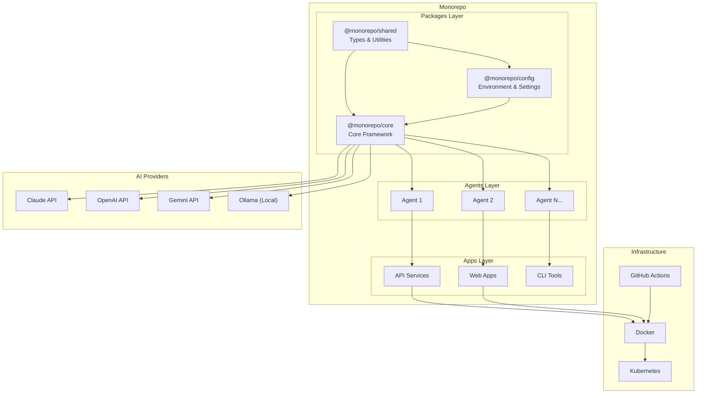
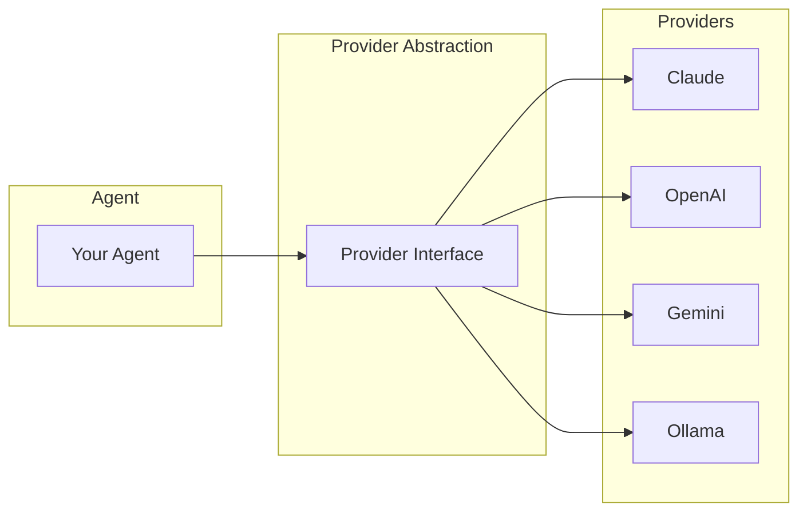
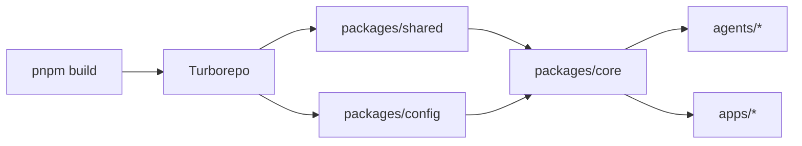

# Architecture Overview

This document describes the architecture of the Monorepo Template.

## Documentation Index

| Document                                        | Description                       |
| ----------------------------------------------- | --------------------------------- |
| [Monorepo Structure](monorepo-structure.md)     | Directory layout and organization |
| [Package Dependencies](package-dependencies.md) | Package relationship diagram      |
| [Agent Architecture](agent-architecture.md)     | AI agent design patterns          |
| [CI/CD Pipeline](ci-cd-pipeline.md)             | Automation workflows              |
| [Tech Stack](tech-stack.md)                     | Technologies and tools            |

## High-Level Architecture



## Core Concepts

### 1. Layered Architecture

The monorepo follows a layered architecture:

| Layer        | Purpose                   | Location    |
| ------------ | ------------------------- | ----------- |
| **Packages** | Shared libraries          | `packages/` |
| **Agents**   | AI agent implementations  | `agents/`   |
| **Apps**     | Applications and services | `apps/`     |
| **Tools**    | CLI utilities             | `tools/`    |

### 2. Package Hierarchy

```
@monorepo/shared    ← Foundation (types, errors, constants)
         ↓
@monorepo/config    ← Configuration (env, validation)
         ↓
@monorepo/core      ← Framework (base classes, utilities)
         ↓
    Your Apps       ← Implementation (applications)
```

### 3. Multi-Provider AI Support

The framework supports multiple AI providers:



### 4. Build System

Turborepo orchestrates builds with:

- **Dependency-aware builds** - Packages build in correct order
- **Caching** - Skip unchanged packages
- **Parallelization** - Build independent packages concurrently



## Design Principles

1. **Separation of Concerns** - Each package has a single responsibility
2. **Dependency Inversion** - Depend on abstractions, not implementations
3. **Configuration as Code** - Environment validated with Zod schemas
4. **Type Safety** - TypeScript strict mode throughout
5. **Testability** - Dependency injection for easy mocking

## Key Components

### Shared Package (`@monorepo/shared`)

- Type definitions
- Error classes
- Constants
- Utility functions

### Config Package (`@monorepo/config`)

- Environment variable loading
- Schema validation (Zod)
- Configuration helpers

### Core Package (`@monorepo/core`)

- Base utilities
- Helper functions
- Common abstractions

## Next Steps

- [Monorepo Structure](monorepo-structure.md) - Detailed directory layout
- [Agent Architecture](agent-architecture.md) - Design patterns
- [Tech Stack](tech-stack.md) - Technologies used

---

**Developed by [BEMIND TECHNOLOGY CO., LTD.](https://www.bemind.tech/)** | [info@bemind.tech](mailto:info@bemind.tech)
