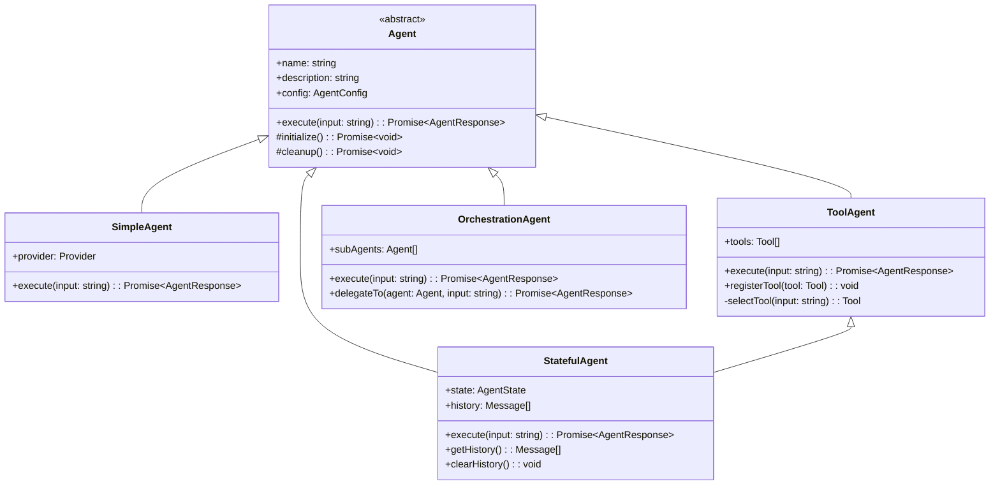
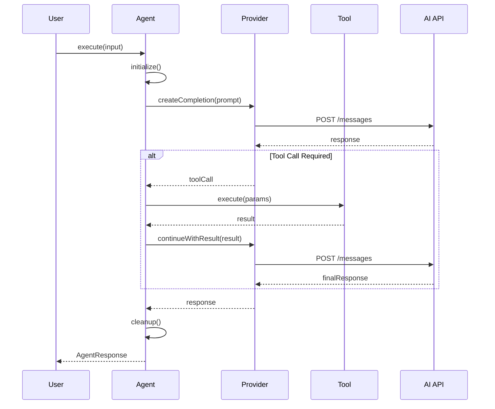
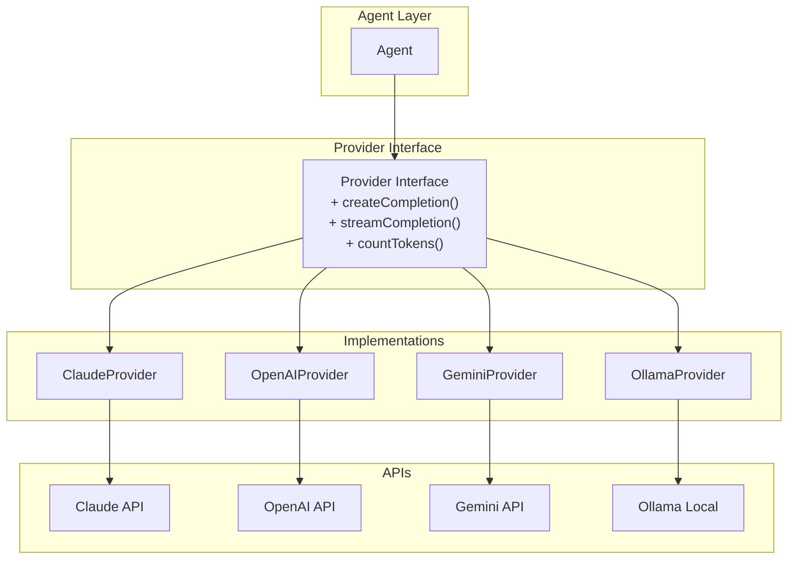
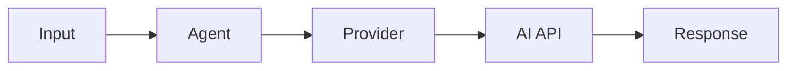
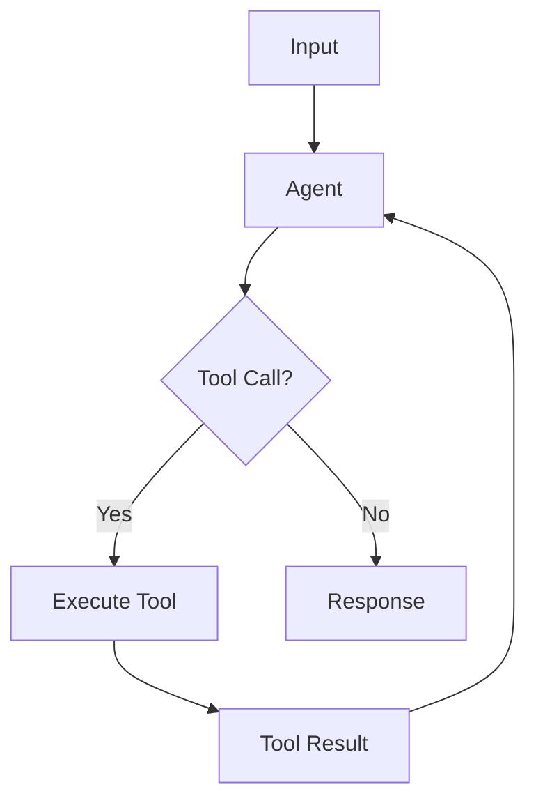
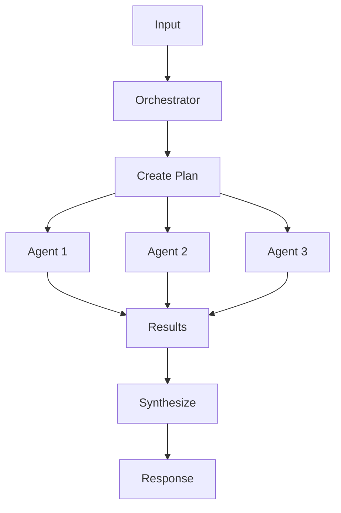
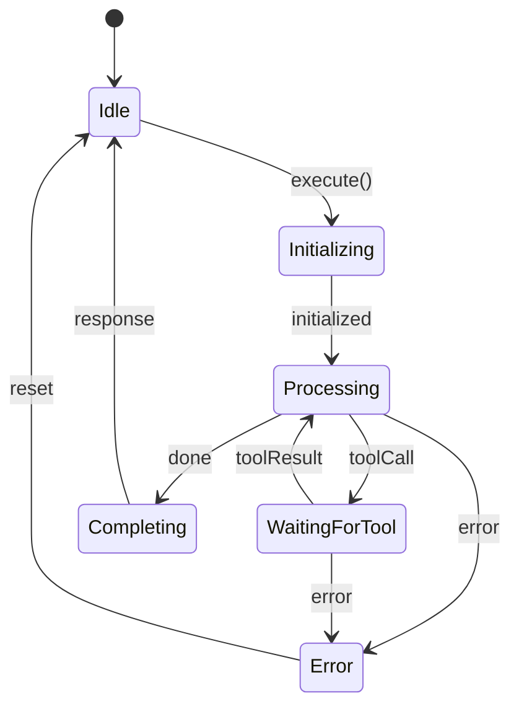
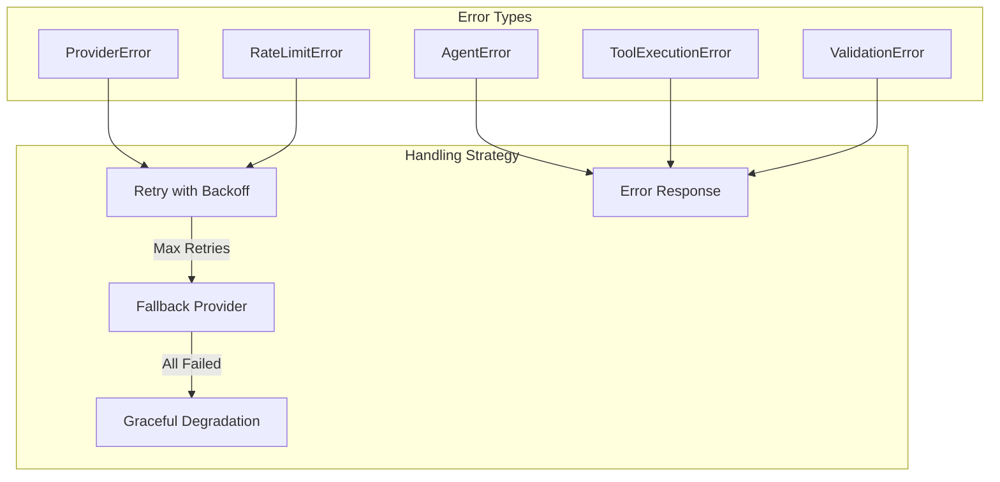

# Agent Architecture

Design patterns and architecture for building AI agents.

## Agent Class Hierarchy



## Agent Execution Flow



## Provider Abstraction



## Agent Patterns

### 1. Simple Agent Pattern

Single-turn completion without tools.

```typescript
class SimpleAgent extends Agent {
  async execute(input: string): Promise<AgentResponse> {
    const response = await this.provider.createCompletion({
      model: this.config.model,
      messages: [{ role: 'user', content: input }],
    });

    return {
      success: true,
      data: response.content,
    };
  }
}
```



### 2. Tool Agent Pattern

Agent that can use tools to complete tasks.

```typescript
class ToolAgent extends Agent {
  private tools: Map<string, Tool>;

  async execute(input: string): Promise<AgentResponse> {
    let response = await this.provider.createCompletion({
      messages: [{ role: 'user', content: input }],
      tools: this.getToolDefinitions(),
    });

    while (response.toolCalls?.length) {
      const results = await this.executeTools(response.toolCalls);
      response = await this.provider.continueWithResults(results);
    }

    return { success: true, data: response.content };
  }
}
```



### 3. Stateful Agent Pattern

Agent that maintains conversation history.

```typescript
class StatefulAgent extends Agent {
  private history: Message[] = [];

  async execute(input: string): Promise<AgentResponse> {
    this.history.push({ role: 'user', content: input });

    const response = await this.provider.createCompletion({
      messages: this.history,
    });

    this.history.push({ role: 'assistant', content: response.content });

    return { success: true, data: response.content };
  }
}
```

### 4. Orchestration Pattern

Agent that coordinates multiple sub-agents.

```typescript
class OrchestrationAgent extends Agent {
  private subAgents: Map<string, Agent>;

  async execute(input: string): Promise<AgentResponse> {
    const plan = await this.createPlan(input);

    for (const step of plan.steps) {
      const agent = this.subAgents.get(step.agentName);
      const result = await agent.execute(step.input);
      // Process result...
    }

    return this.synthesizeResults();
  }
}
```



## State Management



## Error Handling



## Best Practices

1. **Single Responsibility** - Each agent should do one thing well
2. **Dependency Injection** - Inject providers and tools for testability
3. **Immutable State** - Don't mutate shared state
4. **Error Boundaries** - Catch and handle errors at agent boundaries
5. **Logging** - Log all interactions for debugging
6. **Rate Limiting** - Respect API rate limits
7. **Cost Tracking** - Monitor token usage and costs

---

**Developed by [BEMIND TECHNOLOGY CO., LTD.](https://www.bemind.tech/)** | [info@bemind.tech](mailto:info@bemind.tech)
