# CI/CD Pipeline

Continuous integration and deployment workflows.

## Pipeline Overview

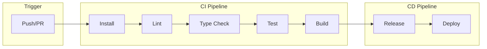

## GitHub Actions Workflows

### Main CI Workflow

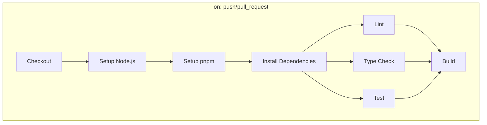

### Agent Workflows

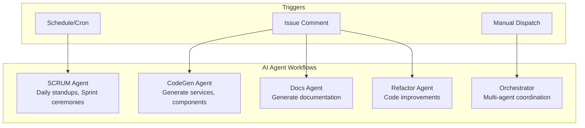

## Workflow Stages

### 1. Install Stage

```yaml
- name: Setup pnpm
  uses: pnpm/action-setup@v2

- name: Setup Node.js
  uses: actions/setup-node@v4
  with:
    node-version: '22'
    cache: 'pnpm'

- name: Install dependencies
  run: pnpm install --frozen-lockfile
```

### 2. Quality Gates

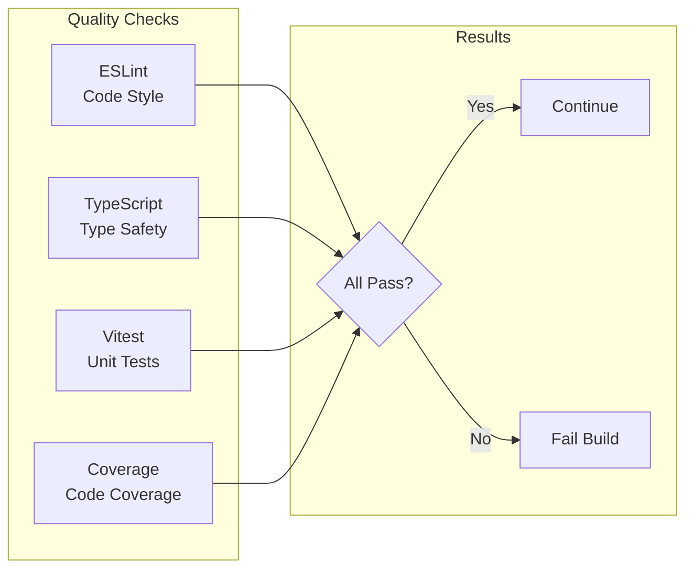

### 3. Build Stage

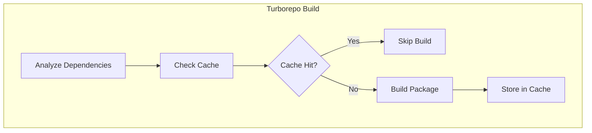

### 4. Release Stage

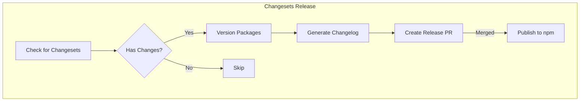

## Environment Strategy

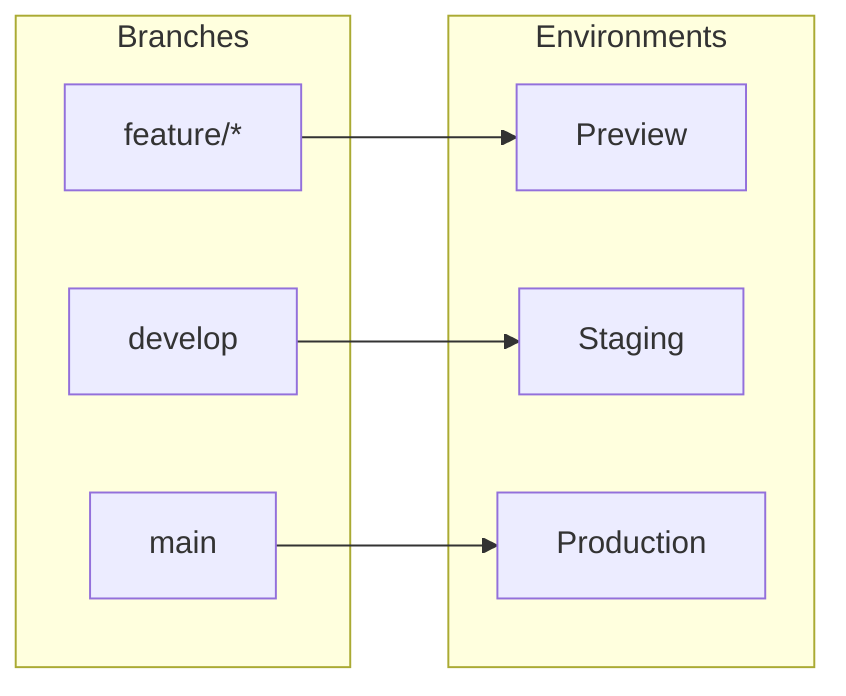

## Secrets Management

| Secret              | Purpose           | Scope            |
| ------------------- | ----------------- | ---------------- |
| `GITHUB_TOKEN`      | GitHub API access | All workflows    |
| `NPM_TOKEN`         | npm publishing    | Release workflow |
| `ANTHROPIC_API_KEY` | Claude API        | Agent workflows  |
| `OPENAI_API_KEY`    | OpenAI API        | Agent workflows  |
| `GOOGLE_AI_API_KEY` | Gemini API        | Agent workflows  |

## Caching Strategy

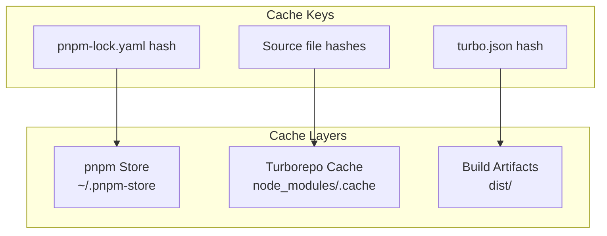

## Deployment Flow

### Docker Deployment

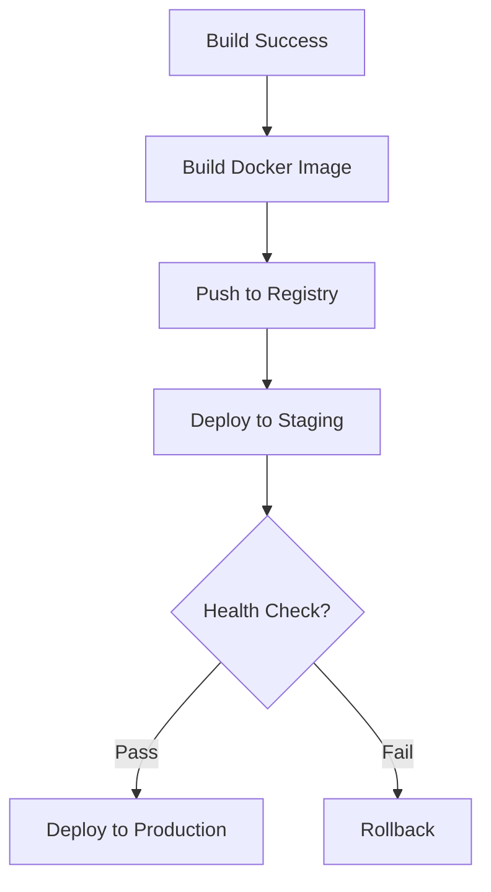

### Kubernetes Deployment

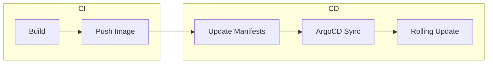

## Monitoring

### Pipeline Metrics

| Metric           | Target  | Alert Threshold |
| ---------------- | ------- | --------------- |
| Build Time       | < 5 min | > 10 min        |
| Test Coverage    | > 80%   | < 70%           |
| Success Rate     | > 95%   | < 90%           |
| Deploy Frequency | Daily   | < Weekly        |

### Health Checks

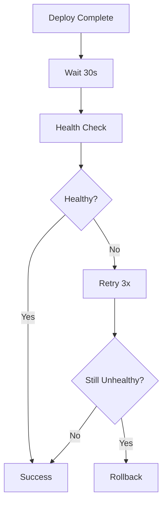

## Rollback Strategy

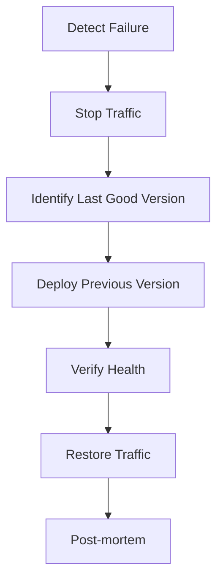
