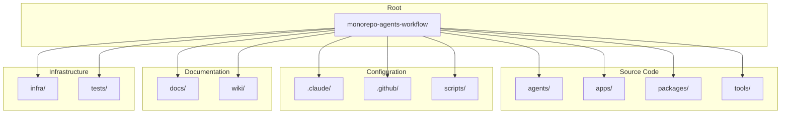

# Monorepo Structure

Detailed breakdown of the repository organization.

## Directory Tree

```
monorepo-agents-workflow/
├── .claude/                    # Claude Code configuration
│   ├── agents/                 # Agent specifications
│   ├── commands/               # Slash commands
│   └── settings.json           # Claude settings
│
├── .github/                    # GitHub configuration
│   ├── workflows/              # CI/CD pipelines
│   ├── ISSUE_TEMPLATE/         # Issue templates
│   └── CODEOWNERS              # Code ownership
│
├── agents/                     # AI Agent implementations
│   └── <agent-name>/
│       ├── src/
│       │   ├── agent.ts        # Agent class
│       │   ├── tools/          # Agent tools
│       │   └── index.ts        # Exports
│       ├── package.json
│       └── tsconfig.json
│
├── apps/                       # Applications
│   ├── api/                    # API services
│   └── web/                    # Web applications
│
├── packages/                   # Shared packages
│   ├── core/                   # Agent framework
│   ├── shared/                 # Types & utilities
│   └── config/                 # Configuration
│
├── tools/                      # CLI tools
│
├── scripts/                    # Utility scripts
│   ├── init-project.sh         # Project setup
│   └── setup-api-keys.sh       # API key configuration
│
├── docs/                       # Documentation
│   ├── architecture/           # Architecture docs
│   ├── guides/                 # User guides
│   └── api/                    # API documentation
│
├── infra/                      # Infrastructure
│   ├── docker/                 # Docker configs
│   ├── k8s/                    # Kubernetes manifests
│   └── firebase/               # Firebase configs
│
├── tests/                      # Shared test utilities
│   ├── unit/                   # Unit tests
│   ├── integration/            # Integration tests
│   └── e2e/                    # End-to-end tests
│
├── wiki/                       # GitHub Wiki content
│
├── package.json                # Root package.json
├── pnpm-workspace.yaml         # Workspace configuration
├── turbo.json                  # Turborepo config
├── tsconfig.base.json          # Base TypeScript config
└── vitest.config.ts            # Test configuration
```

## Directory Diagram



## Package Structure

### packages/shared

```
packages/shared/
├── src/
│   ├── types/              # TypeScript types
│   │   ├── agent.ts        # Agent types
│   │   ├── provider.ts     # Provider types
│   │   └── index.ts
│   ├── errors/             # Custom error classes
│   │   ├── agent-error.ts
│   │   ├── tool-error.ts
│   │   └── index.ts
│   ├── constants/          # Shared constants
│   │   └── index.ts
│   └── index.ts            # Package exports
├── package.json
├── tsconfig.json
└── tsup.config.ts
```

### packages/config

```
packages/config/
├── src/
│   ├── env/                # Environment handling
│   │   ├── schema.ts       # Zod schemas
│   │   ├── loader.ts       # Env loader
│   │   └── index.ts
│   ├── helpers/            # Helper functions
│   │   ├── is-dev.ts
│   │   ├── is-prod.ts
│   │   └── index.ts
│   └── index.ts
├── package.json
└── tsconfig.json
```

### packages/core

```
packages/core/
├── src/
│   ├── agent/              # Agent base classes
│   │   ├── base-agent.ts
│   │   ├── simple-agent.ts
│   │   └── index.ts
│   ├── providers/          # AI provider implementations
│   │   ├── base-provider.ts
│   │   ├── claude.ts
│   │   ├── openai.ts
│   │   ├── gemini.ts
│   │   ├── ollama.ts
│   │   └── index.ts
│   ├── tools/              # Tool definitions
│   │   ├── base-tool.ts
│   │   └── index.ts
│   └── index.ts
├── package.json
└── tsconfig.json
```

## Agent Structure

```
agents/<agent-name>/
├── src/
│   ├── agent.ts            # Main agent class
│   ├── config.ts           # Agent configuration
│   ├── tools/              # Custom tools
│   │   ├── tool-a.ts
│   │   ├── tool-b.ts
│   │   └── index.ts
│   ├── prompts/            # Prompt templates
│   │   └── system.ts
│   ├── __tests__/          # Tests
│   │   └── agent.test.ts
│   └── index.ts            # Exports
├── package.json
├── tsconfig.json
└── README.md
```

## Application Structure

### API Application

```
apps/api/
├── src/
│   ├── modules/            # Feature modules
│   │   └── <module>/
│   │       ├── controller.ts
│   │       ├── service.ts
│   │       ├── dto/
│   │       └── module.ts
│   ├── common/             # Shared utilities
│   ├── config/             # App configuration
│   └── main.ts             # Entry point
├── package.json
└── tsconfig.json
```

### Web Application

```
apps/web/
├── src/
│   ├── app/                # Next.js App Router
│   │   ├── layout.tsx
│   │   ├── page.tsx
│   │   └── api/
│   ├── components/         # React components
│   ├── lib/                # Utilities
│   └── styles/             # CSS/Tailwind
├── package.json
└── tsconfig.json
```

## Workspace Configuration

### pnpm-workspace.yaml

```yaml
packages:
  - 'packages/*'
  - 'agents/*'
  - 'apps/*'
  - 'tools/*'
```

### Package Naming Convention

| Location  | Package Name Pattern            |
| --------- | ------------------------------- |
| packages/ | `@monorepo-agents/<name>`       |
| agents/   | `@monorepo-agents/<agent-name>` |
| apps/     | `@monorepo-agents/<app-name>`   |
| tools/    | `@monorepo-agents/<tool-name>`  |

## File Naming Conventions

| Type      | Convention  | Example           |
| --------- | ----------- | ----------------- |
| Files     | kebab-case  | `user-service.ts` |
| Classes   | PascalCase  | `UserService`     |
| Functions | camelCase   | `getUserById`     |
| Constants | UPPER_SNAKE | `MAX_RETRIES`     |
| Types     | PascalCase  | `UserResponse`    |
