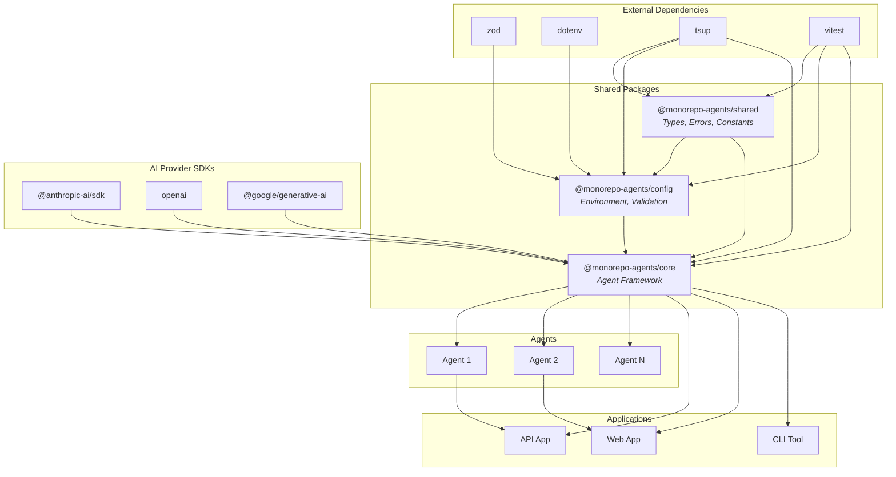
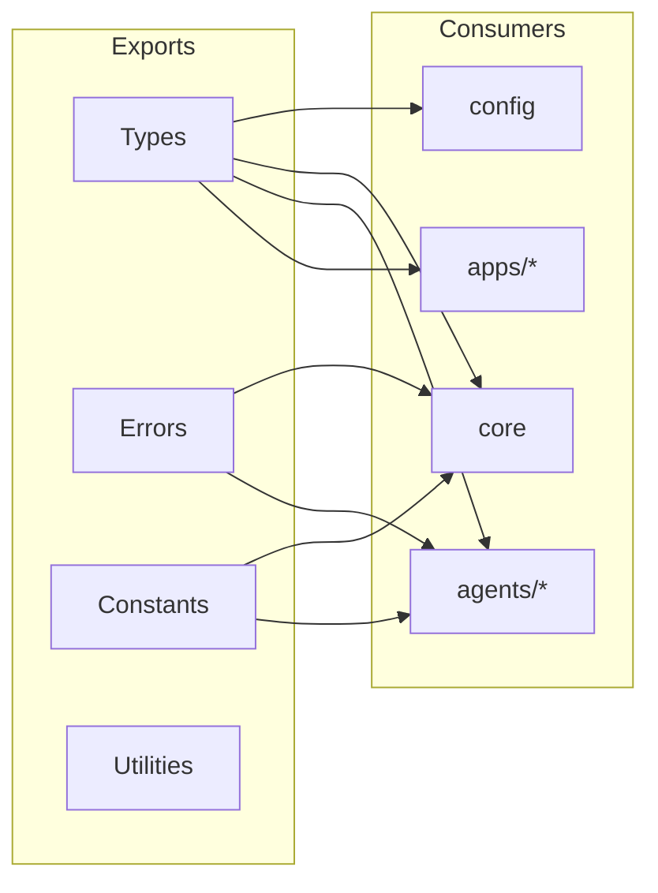
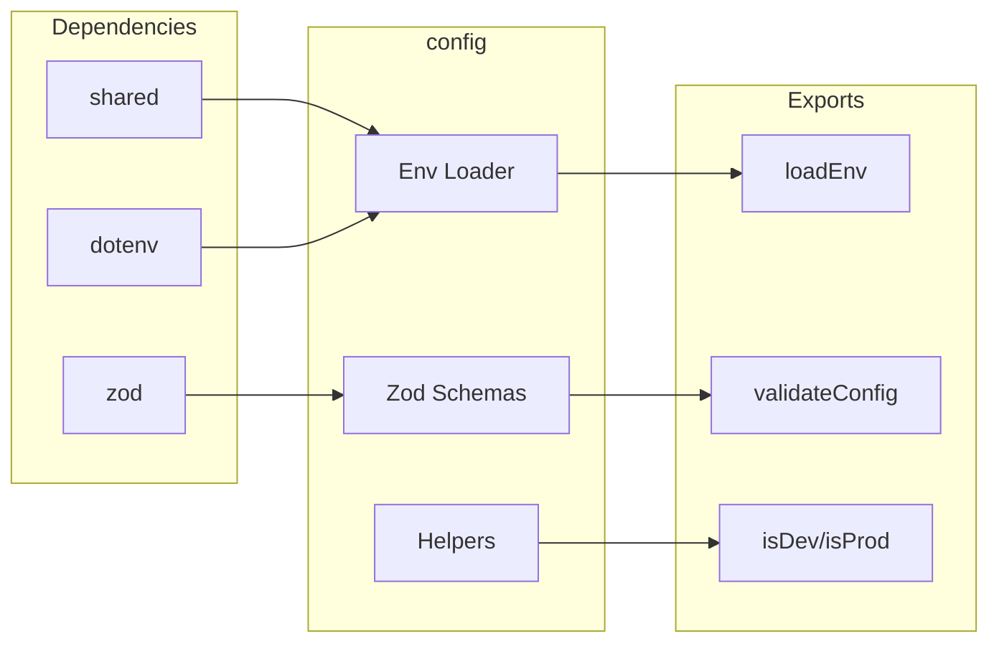
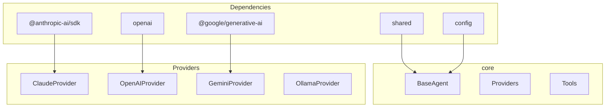
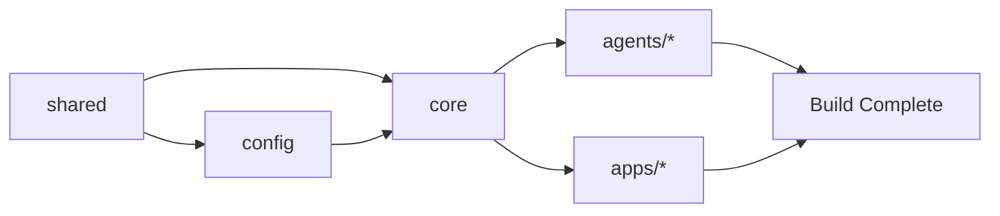

# Package Dependencies

Visual representation of package relationships and dependency flow.

## Dependency Graph



## Dependency Matrix

| Package                   | Depends On              | Used By                    |
| ------------------------- | ----------------------- | -------------------------- |
| `@monorepo-agents/shared` | -                       | config, core, agents, apps |
| `@monorepo-agents/config` | shared, zod, dotenv     | core, agents, apps         |
| `@monorepo-agents/core`   | shared, config, AI SDKs | agents, apps               |

## Package Details

### @monorepo-agents/shared

**Purpose:** Foundation types and utilities



**Dependencies:** None (leaf package)

**Exports:**

- `AgentConfig`, `AgentResponse` - Agent types
- `ProviderConfig`, `ProviderResponse` - Provider types
- `AgentError`, `ToolExecutionError` - Error classes
- `AGENT_TYPES`, `DEFAULT_MODEL` - Constants

### @monorepo-agents/config

**Purpose:** Configuration and environment management



**Dependencies:**

- `@monorepo-agents/shared`
- `zod` - Schema validation
- `dotenv` - Environment loading

**Exports:**

- `loadEnv()` - Load environment variables
- `validateConfig()` - Validate configuration
- `isDev()`, `isProd()`, `isTest()` - Environment helpers

### @monorepo-agents/core

**Purpose:** Agent framework and AI provider abstraction



**Dependencies:**

- `@monorepo-agents/shared`
- `@monorepo-agents/config`
- AI Provider SDKs (optional peer dependencies)

**Exports:**

- `Agent`, `SimpleAgent` - Base classes
- `ClaudeProvider`, `OpenAIProvider`, `GeminiProvider`, `OllamaProvider`
- `Tool`, `ToolResult` - Tool abstractions

## Build Order

Turborepo ensures packages build in dependency order:



## Version Management

All packages use workspace protocol for internal dependencies:

```json
{
  "dependencies": {
    "@monorepo-agents/shared": "workspace:*",
    "@monorepo-agents/config": "workspace:*",
    "@monorepo-agents/core": "workspace:*"
  }
}
```

This ensures:

- Packages always use local versions during development
- Version conflicts are avoided
- Changes propagate immediately
