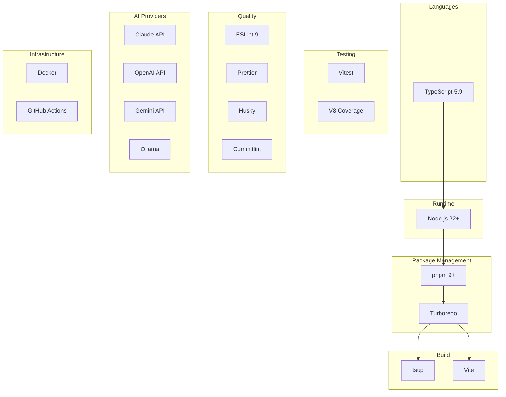
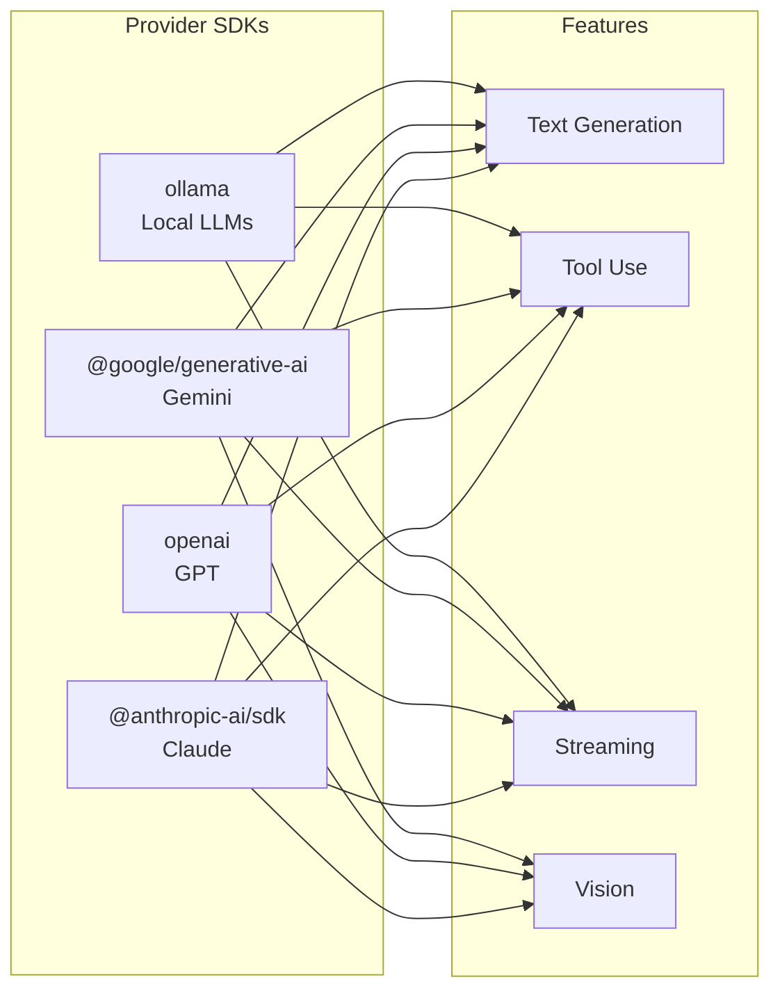
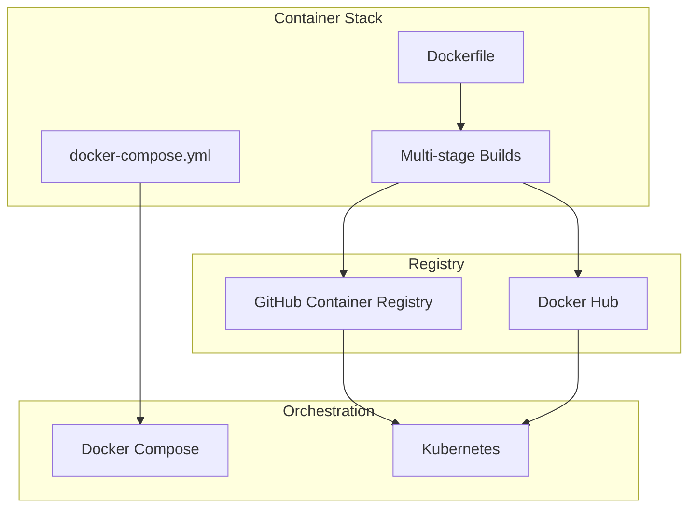
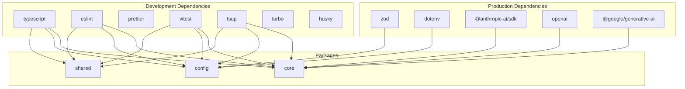

# Tech Stack

Technologies and tools used in the monorepo.

## Stack Overview

## Core Technologies

### Language & Runtime

| Technology | Version | Purpose              |
| ---------- | ------- | -------------------- |
| TypeScript | 5.9+    | Type-safe JavaScript |
| Node.js    | 22+     | JavaScript runtime   |
| ESM        | -       | Module system        |

### Build System

| Technology | Version | Purpose                      |
| ---------- | ------- | ---------------------------- |
| pnpm       | 9+      | Package manager              |
| Turborepo  | 2+      | Monorepo build orchestration |
| tsup       | 8+      | TypeScript bundler           |
| Vite       | 5+      | Frontend build tool          |

### Testing

| Technology          | Version | Purpose       |
| ------------------- | ------- | ------------- |
| Vitest              | 2+      | Test runner   |
| @vitest/coverage-v8 | 2+      | Code coverage |

### Code Quality

| Technology  | Version | Purpose                |
| ----------- | ------- | ---------------------- |
| ESLint      | 9+      | Linting                |
| Prettier    | 3+      | Code formatting        |
| Husky       | 9+      | Git hooks              |
| Commitlint  | 19+     | Commit message linting |
| lint-staged | 15+     | Pre-commit checks      |

## AI Provider SDKs

| Provider | SDK                     | Features                       |
| -------- | ----------------------- | ------------------------------ |
| Claude   | `@anthropic-ai/sdk`     | Text, Tools, Streaming, Vision |
| OpenAI   | `openai`                | Text, Tools, Streaming, Vision |
| Gemini   | `@google/generative-ai` | Text, Tools, Streaming, Vision |
| Ollama   | HTTP API                | Text, Tools, Streaming         |

## Configuration Libraries

| Library | Purpose                      |
| ------- | ---------------------------- |
| Zod     | Runtime type validation      |
| dotenv  | Environment variable loading |

## Infrastructure

### Containerization

### CI/CD

| Tool           | Purpose            |
| -------------- | ------------------ |
| GitHub Actions | CI/CD pipelines    |
| Changesets     | Version management |
| Renovate       | Dependency updates |

## Development Tools

### IDE Support

| Tool                 | Purpose           |
| -------------------- | ----------------- |
| VS Code              | Primary IDE       |
| ESLint extension     | Real-time linting |
| Prettier extension   | Format on save    |
| TypeScript extension | IntelliSense      |

### Claude Code Integration

| Feature        | Purpose               |
| -------------- | --------------------- |
| Slash Commands | Automated workflows   |
| Agent Specs    | AI agent definitions  |
| Skills         | Reusable capabilities |

## Dependency Graph

## Version Compatibility Matrix

| Node.js | pnpm | TypeScript | Turborepo |
| ------- | ---- | ---------- | --------- |
| 22.x    | 9.x  | 5.9.x      | 2.x       |
| 23.x    | 9.x  | 5.9.x      | 2.x       |

## Performance Optimizations

### Build Performance

- **Turborepo Caching** - Skip unchanged packages
- **Parallel Execution** - Build independent packages concurrently
- **Incremental TypeScript** - Only recompile changed files

### Runtime Performance

- **ESM Modules** - Native module support
- **Tree Shaking** - Remove unused code
- **Lazy Loading** - Load modules on demand

## Security

| Tool              | Purpose                |
| ----------------- | ---------------------- |
| npm audit         | Vulnerability scanning |
| Dependabot        | Automated updates      |
| CODEOWNERS        | Access control         |
| Branch Protection | Merge requirements     |
